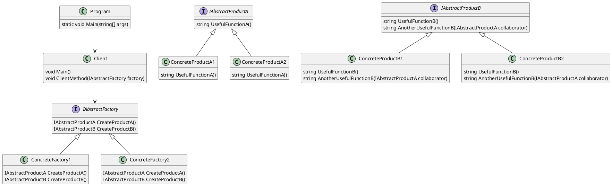

```plantuml
@startuml
interface IAbstractFactory {
	IAbstractProductA CreateProductA()
	IAbstractProductB CreateProductB()
}
class ConcreteFactory1 {
	IAbstractProductA CreateProductA()
	IAbstractProductB CreateProductB()
}
class ConcreteFactory2 {
	IAbstractProductA CreateProductA()
	IAbstractProductB CreateProductB()
}
interface IAbstractProductA {
	string UsefulFunctionA()
}
class ConcreteProductA1 {
	string UsefulFunctionA()
}
class ConcreteProductA2 {
	string UsefulFunctionA()
}
interface IAbstractProductB {
	string UsefulFunctionB()
	string AnotherUsefulFunctionB(IAbstractProductA collaborator)
}
class ConcreteProductB1 {
	string UsefulFunctionB()
	string AnotherUsefulFunctionB(IAbstractProductA collaborator)
}
class ConcreteProductB2 {
	string UsefulFunctionB()
	string AnotherUsefulFunctionB(IAbstractProductA collaborator)
}
class Client {
	void Main()
	void ClientMethod(IAbstractFactory factory)
}
class Program {
	static void Main(string[] args)
}

IAbstractFactory <|-- ConcreteFactory1
IAbstractFactory <|-- ConcreteFactory2
IAbstractProductA <|-- ConcreteProductA1
IAbstractProductA <|-- ConcreteProductA2
IAbstractProductB <|-- ConcreteProductB1
IAbstractProductB <|-- ConcreteProductB2
Client --> IAbstractFactory
Program --> Client
@enduml
```