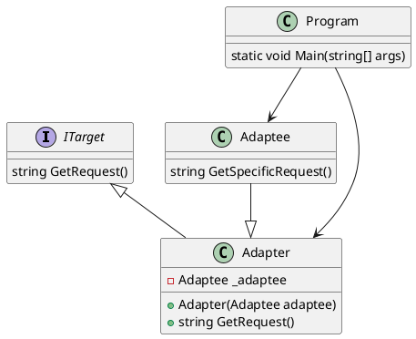

```plantuml
@startuml
interface ITarget {
    string GetRequest()
}
class Adaptee {
    string GetSpecificRequest()
}
class Adapter {
    - Adaptee _adaptee
    + Adapter(Adaptee adaptee)
    + string GetRequest()
}
class Program {
    static void Main(string[] args)
}
ITarget <|-- Adapter
Adaptee --|> Adapter
Program --> Adaptee
Program --> Adapter
@enduml
```