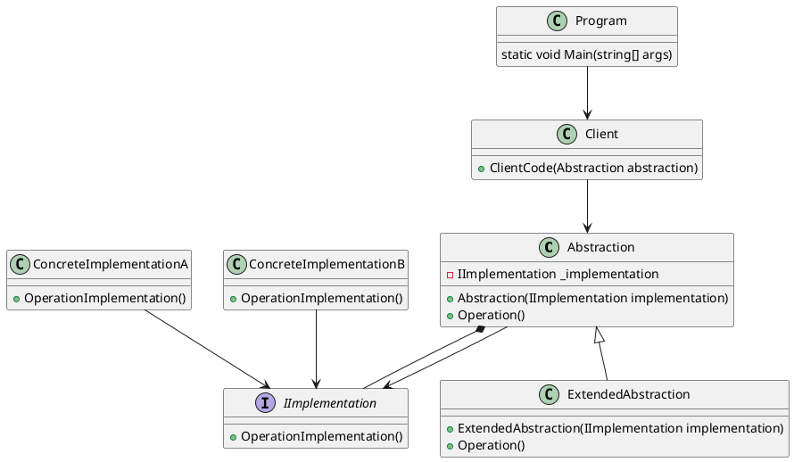

```plantuml
@startuml
class Abstraction {
    - IImplementation _implementation
    + Abstraction(IImplementation implementation)
    + Operation()
}
class ExtendedAbstraction {
    + ExtendedAbstraction(IImplementation implementation)
    + Operation()
}
interface IImplementation {
    + OperationImplementation()
}
class ConcreteImplementationA {
    + OperationImplementation()
}
class ConcreteImplementationB {
    + OperationImplementation()
}
class Client {
    + ClientCode(Abstraction abstraction)
}
class Program {
    static void Main(string[] args)
}
Abstraction <|-- ExtendedAbstraction
Abstraction *-- IImplementation
Abstraction --> IImplementation
Client --> Abstraction
Program --> Client
ConcreteImplementationA --> IImplementation
ConcreteImplementationB --> IImplementation
@enduml
```