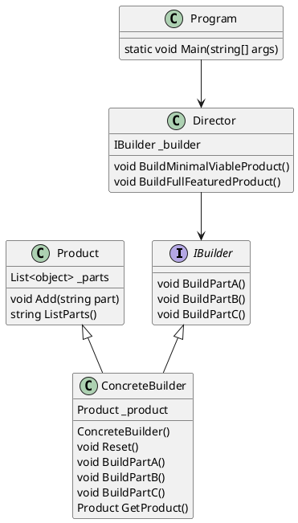

```plantuml
@startuml
interface IBuilder {
	void BuildPartA()
	void BuildPartB()
	void BuildPartC()
}
class ConcreteBuilder {
	Product _product
	ConcreteBuilder()
	void Reset()
	void BuildPartA()
	void BuildPartB()
	void BuildPartC()
	Product GetProduct()
}
class Product {
	List<object> _parts
	void Add(string part)
	string ListParts()
}
class Director {
	IBuilder _builder
	void BuildMinimalViableProduct()
	void BuildFullFeaturedProduct()
}
class Program {
	static void Main(string[] args)
}

IBuilder <|-- ConcreteBuilder
Product <|-- ConcreteBuilder
Director --> IBuilder
Program --> Director
@enduml
```