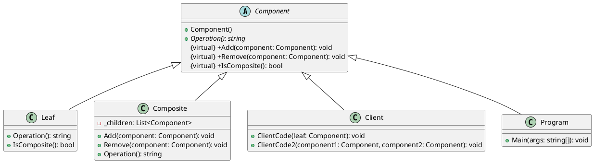

```plantuml
@startuml
abstract class Component {
    +Component()
    {abstract} +Operation(): string
    {virtual} +Add(component: Component): void
    {virtual} +Remove(component: Component): void
    {virtual} +IsComposite(): bool
}
class Leaf {
    +Operation(): string
    +IsComposite(): bool
}
class Composite {
    -_children: List<Component>
    +Add(component: Component): void
    +Remove(component: Component): void
    +Operation(): string
}
class Client {
    +ClientCode(leaf: Component): void
    +ClientCode2(component1: Component, component2: Component): void
}
class Program {
    +Main(args: string[]): void
}

Component <|-- Leaf
Component <|-- Composite
Component <|-- Client
Component <|-- Program
@enduml
```