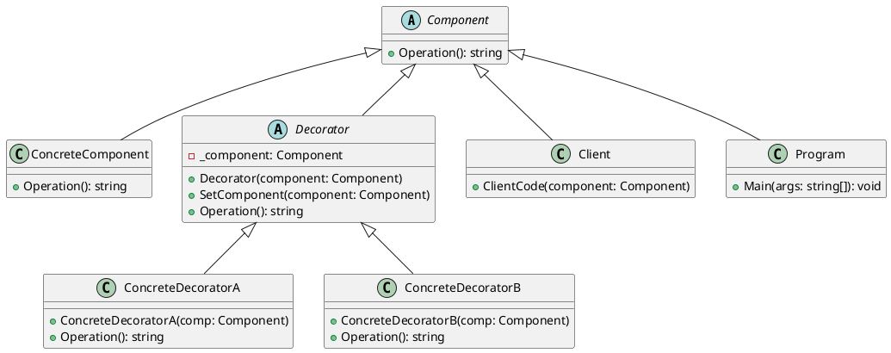

```plantuml
@startuml
abstract class Component {
    +Operation(): string
}
class ConcreteComponent {
    +Operation(): string
}
abstract class Decorator {
    -_component: Component
    +Decorator(component: Component)
    +SetComponent(component: Component)
    +Operation(): string
}
class ConcreteDecoratorA {
    +ConcreteDecoratorA(comp: Component)
    +Operation(): string
}
class ConcreteDecoratorB {
    +ConcreteDecoratorB(comp: Component)
    +Operation(): string
}
class Client {
    +ClientCode(component: Component)
}
class Program {
    +Main(args: string[]): void
}

Component <|-- ConcreteComponent
Component <|-- Decorator
Component <|-- Client
Component <|-- Program

Decorator <|-- ConcreteDecoratorA
Decorator <|-- ConcreteDecoratorB
@enduml
```
