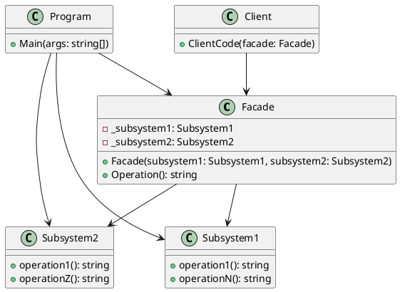

```plantuml
@startuml
class Facade {
    - _subsystem1: Subsystem1
    - _subsystem2: Subsystem2
    + Facade(subsystem1: Subsystem1, subsystem2: Subsystem2)
    + Operation(): string
}

class Subsystem1 {
    + operation1(): string
    + operationN(): string
}

class Subsystem2 {
    + operation1(): string
    + operationZ(): string
}

class Client {
    + ClientCode(facade: Facade)
}

class Program {
    + Main(args: string[])
}

Facade --> Subsystem1
Facade --> Subsystem2
Client --> Facade
Program --> Subsystem1
Program --> Subsystem2
Program --> Facade

@enduml
```
