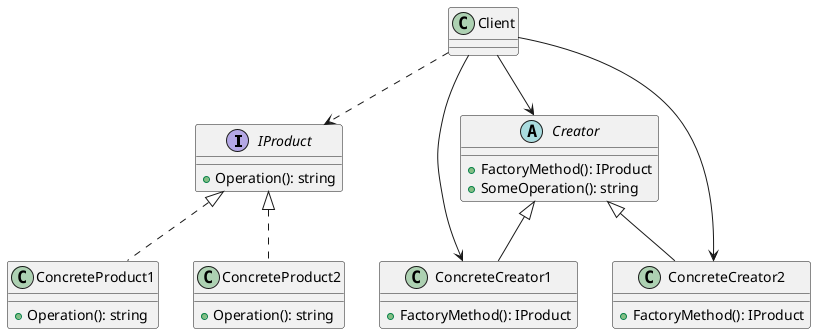

```plantuml
@startuml
interface IProduct {
    +Operation(): string
}

class ConcreteProduct1 {
    +Operation(): string
}

class ConcreteProduct2 {
    +Operation(): string
}

abstract class Creator {
    +FactoryMethod(): IProduct
    +SomeOperation(): string
}

class ConcreteCreator1 {
    +FactoryMethod(): IProduct
}

class ConcreteCreator2 {
    +FactoryMethod(): IProduct
}

Creator <|-- ConcreteCreator1
Creator <|-- ConcreteCreator2
IProduct <|.. ConcreteProduct1
IProduct <|.. ConcreteProduct2

Client --> Creator
Client --> ConcreteCreator1
Client --> ConcreteCreator2

Client ..> IProduct

@enduml
```