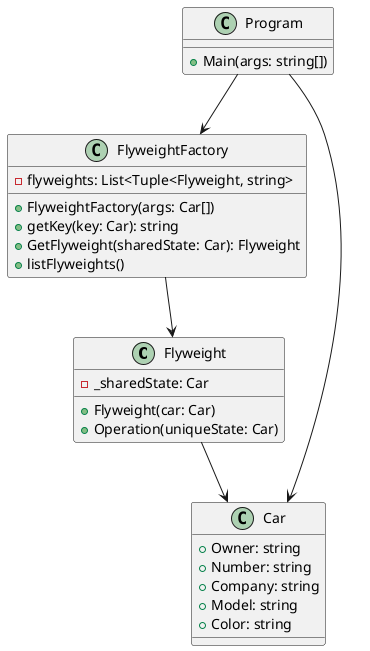

```plantuml
@startuml
class Flyweight {
    - _sharedState: Car
    + Flyweight(car: Car)
    + Operation(uniqueState: Car)
}

class FlyweightFactory {
    - flyweights: List<Tuple<Flyweight, string>
    + FlyweightFactory(args: Car[])
    + getKey(key: Car): string
    + GetFlyweight(sharedState: Car): Flyweight
    + listFlyweights()
}

class Car {
    + Owner: string
    + Number: string
    + Company: string
    + Model: string
    + Color: string
}

class Program {
    + Main(args: string[])
}

Flyweight --> Car
FlyweightFactory --> Flyweight
Program --> FlyweightFactory
Program --> Car
@enduml
```