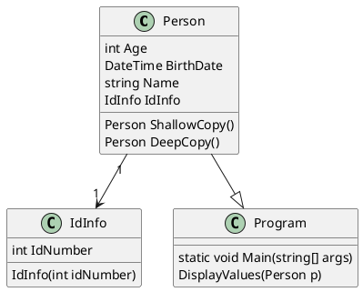

```plantuml
@startuml
class Person {
    int Age
    DateTime BirthDate
    string Name
    IdInfo IdInfo
    Person ShallowCopy()
    Person DeepCopy()
}
class IdInfo {
    int IdNumber
    IdInfo(int idNumber)
}
class Program {
    static void Main(string[] args)
    DisplayValues(Person p)
}
Person "1" --> "1" IdInfo
Person --|> Program
@enduml
```