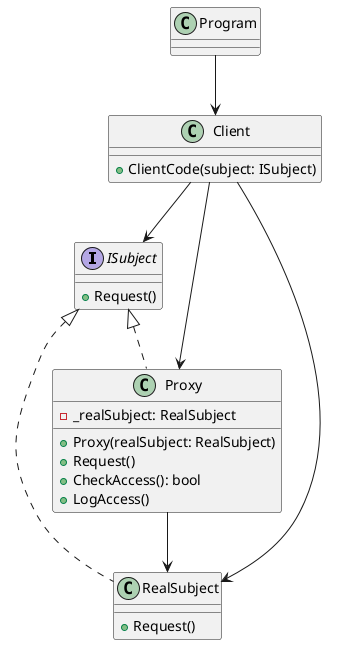

```plantuml
@startuml
interface ISubject {
    + Request()
}

class RealSubject {
    + Request()
}

class Proxy {
    - _realSubject: RealSubject
    + Proxy(realSubject: RealSubject)
    + Request()
    + CheckAccess(): bool
    + LogAccess()
}

class Client {
    + ClientCode(subject: ISubject)
}

Program --> Client
Client --> ISubject
Client --> RealSubject
Client --> Proxy
Proxy --> RealSubject
ISubject <|.. RealSubject
ISubject <|.. Proxy
@enduml
```